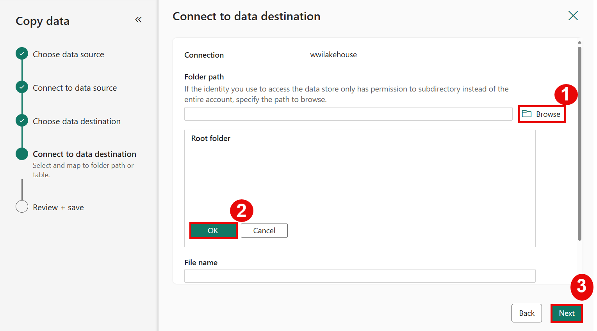

# Exercise 3: Ingest data into the lakehouse

##### **Estimated Duration: 60 minutes**

## Overview

In this exercise, you will ingest additional dimensional and fact tables from the Wide World Importers (WWI) dataset into the lakehouse. You will configure a data pipeline within Microsoft Fabric to enable efficient data ingestion. The data will be validated and organized into a structured format, ensuring it is ready for further analysis and reporting. This exercise demonstrates the platform's ability to handle complex data processes seamlessly, ensuring data is prepared for advanced analysis and insights.

## Lab objective

- Task 1: Ingest data

## Task 1: Ingest data

**Objective:** Import the Wide World Importers dataset into the lakehouse by setting up a data pipeline.

1. Open/Navigate back to the **Fabric Workspace** click on **+ New item (1)** button and select **Data   pipeline (2)**.

   .png)

2. In the **New pipeline** dialog box, specify the name as **IngestDataFromSourceToLakehouse (1)** and select **Create (2)**. A new data factory pipeline is created and opened.

   

3. On your newly created data factory pipeline, select **Copy data assistant** to add an activity to the pipeline.

   

4. Next, set up an HTTP connection to import the sample World Wide Importers data into the Lakehouse. From the list of Choose data sources, search for **Http (1)** and select **Http (2)**.

   

5. In the **Connect to data source** window, enter the details from the table below and select **Next (6)**.

    | Property | 	Value |
    | -- | -- |
    | **URL** | `https://assetsprod.microsoft.com/en-us/wwi-sample-dataset.zip` **(1)** |
    | **Connection** | Create a new connection **(2)**|
    | **Connection name** | wwisampledata **(3)**|
    | **Data gateway** | None **(4)**|
    | **Authentication kind** | Anonymous **(5)**|

   

6. In the next step, enable the **Binary copy** and choose **ZipDeflate (.zip)** as the **Compression type** since the source is a .zip file. Keep the other fields at their default values and click **Next**.

   

7. In **Choose data destination**, select your lakehouse as **wwilakehouse**.

   

8. In the **Connect to data destination** window, click on the **Browse** then **OK** and click **Next**. This will write the data to the Files section of the lakehouse.

   

9. Click **Next**. In the **Review + Save** tab, the copy summary should be set as **Binary to Binary**. Click **Save + Run**. You can schedule pipelines to refresh data periodically. In this tutorial, we only run the pipeline once. The data copy process takes approximately 10-15 minutes to complete.

    
10. You can monitor the pipeline execution and activity in the **Output** tab. You can also view detailed data transfer information by selecting the glasses icon next to the pipeline name, which appears when you hover over the name

    

    >**Note**: The process will take up to 20 minutes to complete. 

11. Now, navigate back to **Fabric workspace** and select **wwilakehouse (1)** to launch **Lakehouse explorer**.

    

12. Validate that in the Lakehouse Explorer view, a new folder **WideWorldImportersDW** has been created and data for all the tables have been copied there.

    >**Note**: Refresh the Files section from the drop-down. 

    

13. The data is generated within the **Files** section of the Lakehouse Explorer. It appears inside a new folder named with a GUID. To make it easier to identify, rename this folder to **wwi-raw-data** by clicking on the **Ellipsis (...) (1)** next to the folder and choosing **Rename (2)** from the menu.

    

    

14. At this point, data for all the tables has been successfully copied into the **wwi-raw-data** folder.

    .png)

   > **Congratulations** on completing the task! Now, it's time to validate it. Here are the steps:
   > - If you receive a success message, you can proceed to the next task.
   > - If not, carefully read the error message and retry the step, following the instructions in the lab guide. 
   > - If you need any assistance, please contact us at cloudlabs-support@spektrasystems.com. We are available 24/7 to help you out.
 
   <validation step="97e3f082-96e0-4665-bdab-1a69221a56d9" />

## Review:
In this exercise, you have:

- Created a data pipeline in Fabric Workspace to facilitate data ingestion.

- Imported the WWI dataset into the lakehouse, leveraging the pipeline to handle the transfer from an HTTP source.

- Validated and organized the imported data into a structured format for further analysis.

## Conclusion
Congratulations on successfully completing the lab. Through this comprehensive exercise, you have demonstrated proficiency in leveraging Microsoft Fabric for end-to-end data workflows. Beginning with the creation of a Fabric workspace, you assigned administrative roles and activated a 60-day trial to explore the platform's capabilities. You proceeded to build a lakehouse, effectively managing both structured and unstructured data, and utilized Power BI to create insightful visualizations.  

Additionally, you designed and executed a data pipeline to ingest and organize dimensional and fact tables from the Wide World Importers dataset, showcasing the seamless integration of data engineering, analytics, and reporting within Microsoft Fabric. This hands-on experience has equipped you with the practical skills needed to manage, analyze, and visualize data in a unified environment, positioning you to handle complex workflows and deliver data-driven insights in professional scenarios.

### You have successfully completed the lab.
