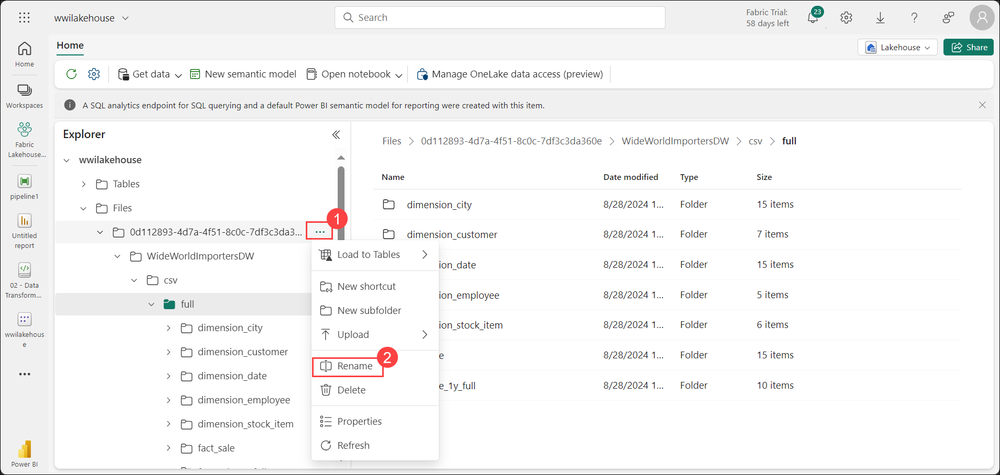

# Exercise 2: Ingest data into the lakehouse

### Estimated Duration: 90 Minutes

## Overview

In this exercise, you will ingest additional dimensional and fact tables from the Wide World Importers (WWI) dataset into the lakehouse. You will configure a data pipeline within Microsoft Fabric to enable efficient data ingestion. The data will be validated and organized into a structured format, ensuring it is ready for further analysis and reporting. This exercise demonstrates the platform's ability to handle complex data processes seamlessly, ensuring data is prepared for advanced analysis and insights.

## Lab objective

- Task 1: Ingest data

## Task 1: Ingest data

**Objective:** In this task you will import the Wide World Importers dataset into the lakehouse by setting up a data pipeline.

1. Navigate to the **Fabric Lakehouse Tutorial** **<inject key="DeploymentID" enableCopy="false" />** Workspace, click on the **+ New item (1)** button and search for the **Data pipeline (2)** in the search bar and select **Data pipeline (3)** from the Get data blade.

   .png)

2. In the **New pipeline** dialog box, specify the name as **IngestDataFromSourceToLakehouse (1)** and click on **Create (2)**.

   .png)

3. From the newly created data factory pipeline, select **Copy data assistant** to add an activity to the pipeline.

   .png)

1. Next, set up an HTTP connection to import the sample World Wide Importers data into the Lakehouse. In the **Choose data sources** list, search for and select **HTTP**.

   .png)

5. In the **Connect to data source** tab, enter the details from the table below and click on **Next (7)**.

    | Property | 	Value |
    | -- | -- |
    | **Url** | `https://assetsprod.microsoft.com/en-us/wwi-sample-dataset.zip` **(1)** |
    | **Connection** | Create a new connection **(2)**|
    | **Connection name** | wwisampledata **(3)**|
    | **Data gateway** | None **(4)**|
    | **Authentication kind** | Anonymous **(5)**|
    | **Privacy Level** | None **(6)**|

   .png)

5. In the next step, enable the **Binary copy (1)** and choose **ZipDeflate (.zip) (2)** as the **Compression type** since the source is a .zip file. Keep the other fields at their default values and click **Next (3)**.

   .png)

1. In the **Choose data destination** tab, search for **Lakehouse (1)** and select **wwilakehouse (2)**.

   .png)

7. In the **Connect to data destination** tab, select **Browse (1)** to choose the root folder, confirm by clicking **OK (2)**, and then click **Next (3)** to continue.

   .png)

8. In the **Review + save** tab, the copy summary should be set as **Binary to Binary**. Click **Save + Run**. You can schedule pipelines to refresh data periodically. In this tutorial, we only run the pipeline once. The data copy process takes approximately 10-15 minutes to complete.

    .png)

9. You can monitor the pipeline execution and activity in the **Output** tab.

   .png)

    >**Note:** The process will take up to 20 minutes to complete. 

11. Now, navigate back to **Fabric Lakehouse Tutorial** **<inject key="DeploymentID" enableCopy="false" />** Workspace and select **wwilakehouse** to launch **Lakehouse explorer**.

    .png)

12. Confirm that a new folder named **WideWorldImportersDW** has been created in the Lakehouse Explorer view, and that it contains the copied data for all tables.

    >**Note:** Refresh the Files section from the drop-down. 

    

13. The data is created in the **Files** section of the Lakehouse Explorer, inside a new folder named with a GUID. To make it easier to identify, rename the folder by clicking the **Ellipsis (...) (1)** next to it and selecting **Rename (2)** from the context menu.

    

14. Enter the Folder name as **wwi-raw-data** and click on **Rename** to apply the change.

    

15. At this point, data for all the tables has been successfully copied into the **wwi-raw-data** folder.

    .png)

   > **Congratulations** on completing the task! Now, it's time to validate it. Here are the steps:
   > - If you receive a success message, you can proceed to the next task.
   > - If not, carefully read the error message and retry the step, following the instructions in the lab guide. 
   > - If you need any assistance, please contact us at cloudlabs-support@spektrasystems.com. We are available 24/7 to help you out.
 
   <validation step="97e3f082-96e0-4665-bdab-1a69221a56d9" />

## Summary:
In this exercise, you have:

- Created a data pipeline in Fabric Workspace to facilitate data ingestion.
- Imported the WWI dataset into the lakehouse, leveraging the pipeline to handle the transfer from an HTTP source.
- Validated and organized the imported data into a structured format for further analysis.

## Conclusion

Congratulations on successfully completing the lab. Through this comprehensive exercise, you have demonstrated proficiency in leveraging Microsoft Fabric for end-to-end data workflows. Beginning with the creation of a Fabric workspace, you activated a 60-day trial to explore the platform's capabilities. You proceeded to build a lakehouse, effectively managing both structured and unstructured data, and utilized Power BI to create insightful visualizations.

Additionally, you designed and executed a data pipeline to ingest and organize dimensional and fact tables from the Wide World Importers dataset, showcasing the seamless integration of data engineering, analytics, and reporting within Microsoft Fabric. This hands-on experience has equipped you with the practical skills needed to manage, analyze, and visualize data in a unified environment, positioning you to handle complex workflows and deliver data-driven insights in professional scenarios.

### You have successfully completed the Hands-on lab.
