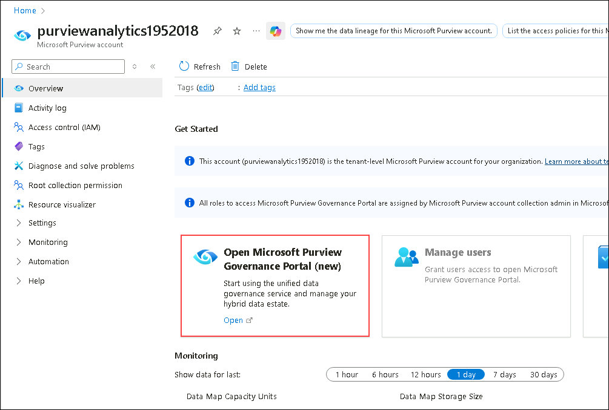
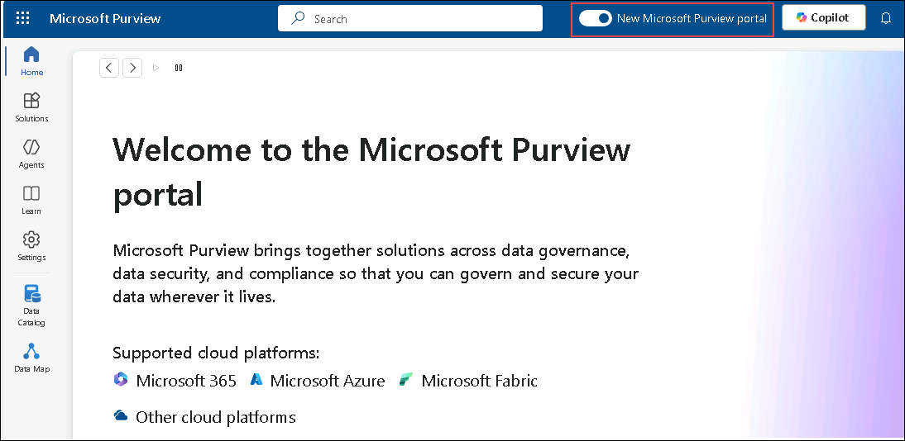
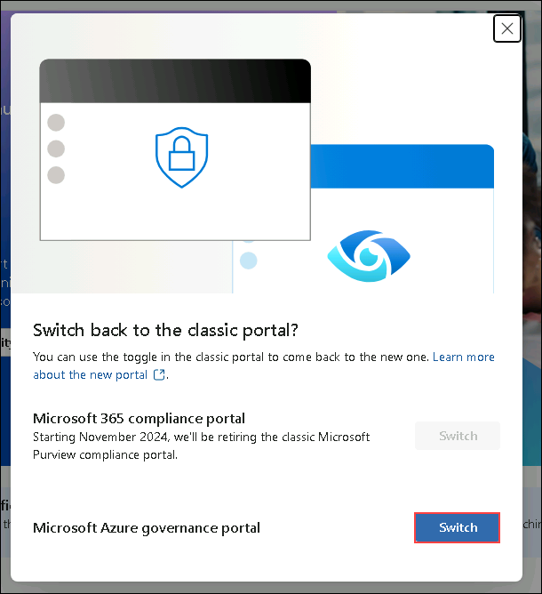
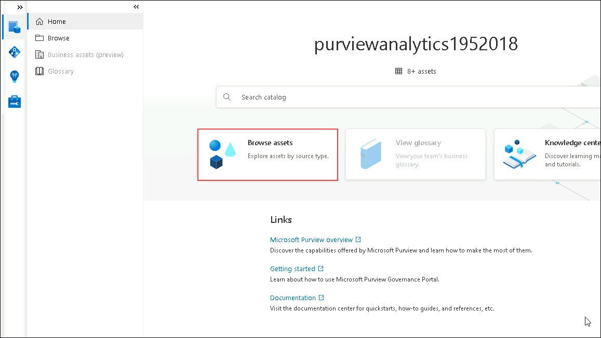

### Exercise 1: Glimpse of Purview to govern the overall data and analytics estate. 

Microsoft Purview provides a unified data governance service that helps manage and govern Wide World Importers’ data, which is stored in multi-cloud environments and in data sources such as Oracle, Teradata, ADLS Gen2, and Azure SQL Database.

In this exercise, you will explore the Wide World Importers data estate that’s registered in Microsoft Purview.

1. In the Azure portal, enter **Microsoft Purview (1)** in the search box at the top of the page and select **Microsoft Purview accounts (2)** from the search results.

   

2. In the **Microsoft Purview accounts** page, select the resource that has a name starting with **purviewanalytics**.

    >**Note:** Each user has their own unique instance of this resource.

    

3. In the Microsoft Purview accounts resource page, in the **Open Microsoft Purview Governance Portal (new)** tile, select the **Open** link.

    

    *Microsoft Purview Governance Portal opens in a new web session (tab).*

1. Close all the pop-ups in the Purview portal and then **turn off** the toggle in **New Microsoft Purview portal**

    

1. Click on **Switch** in **Microsoft Azure governance portal**

    

4. In the Microsoft Purview Governance Portal, select **Browse assets**.

    

1. "Browse assets" in the Microsoft Purview portal is a data discovery feature that allows you to explore your organization's data catalog by navigating a structured hierarchy, much like using a file explorer. Instead of searching for a specific term, you browse through logical "Collections" (like 'Finance' or 'Marketing') or by technology "Source Type" (like 'Azure SQL Databases' or 'Power BI'). This method is ideal for discovering what data is available within different business units and understanding how your data estate is organized.

Congratulations! You as Data Engineers, have helped Wide World Importers gain actionable insights from its disparate data sources, thereby contributing to future growth, customer satisfaction, and competitive advantage.

In this lab, we experienced the creation of a simple, integrated, open and governed Data Lakehouse foundation using the Microsoft Analytics Solution Pattern. 

In this lab, we covered the following:

1. First, we looked at data ingestion from a spectrum of analytical and operational data sources into the Lakehouse. We started with streaming data and analytics pipeline using ADX for a near real-time analytics scenario, followed by Synapse pipelines that ingested raw data from analytical/operational data sources to the Bronze layer. 

2. Second, we explored offline data and analytics pipelines using open Delta format and Azure Databricks Delta Live Tables. We stitched streaming and non-streaming data (landed earlier) together, to create a combined data product to build a simple Lakehouse.

3. Third, we explored ML and BI scenarios on the Lakehouse. Here we reviewed the MLOps pipeline using the Azure Databricks managed MLflow with Azure ML. Then, using Power BI with Synapse serverless SQL pool capabilities, we derived actionable insights. We explored SQL Analytics with Azure Databricks and Azure Synapse Serverless. 

4. Finally, we leveraged Purview for data governance.  

**Congratulations!!!**
**You have completed the Analytics in MIDP Lab.**