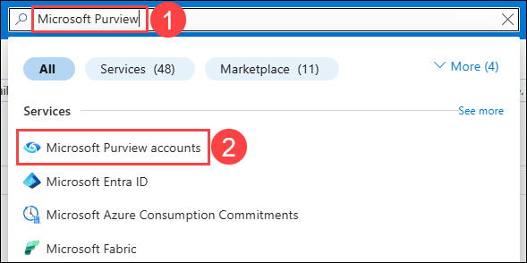
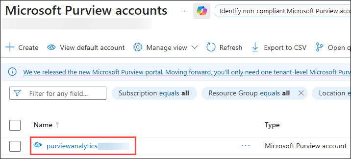
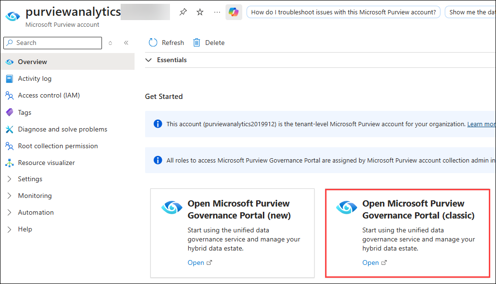
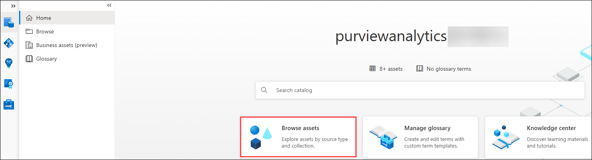

# Exercise 4: Glimpse of Purview to govern the overall data and analytics estate.

### Estimated Duration : 15 minutes

Microsoft Purview provides a unified data governance service that helps manage and govern Wide World Importers’ data, which is stored in multi-cloud environments and in data sources such as Oracle, Teradata, ADLS Gen2, and Azure SQL Database.

In this exercise, you will explore the Wide World Importers data estate that’s registered in Microsoft Purview.

1. In the Azure portal, enter **Microsoft Purview (1)** in the search box at the top of the page and select **Microsoft Purview accounts (2)** from the search results.

   

2. In the **Microsoft Purview accounts** page, select the resource that has a name starting with **purviewanalytics**.

    

    >**Note:** Each user has their own unique instance of this resource.

3. In the Microsoft Purview accounts resource page, in the **Open Microsoft Purview Governance Portal (classic)** tile, select the **Open** link.

    

    *Microsoft Purview Governance Portal opens in a new web session (tab).*

1. Close all the pop-ups in the Purview portal.

1. In the Microsoft Purview Portal, select **Browse assets**.

    

1. "Browse assets" in the Microsoft Purview portal is a data discovery feature that allows you to explore your organization's data catalog by navigating a structured hierarchy, much like using a file explorer. Instead of searching for a specific term, you browse through logical "Collections" (like 'Finance' or 'Marketing') or by technology "Source Type" (like 'Azure SQL Databases' or 'Power BI'). This method is ideal for discovering what data is available within different business units and understanding how your data estate is organized.

## Summary

In this exercise, you have explored on the basic features of Microsoft Purview to govern the overall data and analytics estate.

### You have successfully completed the Real Time Analytics with Synapse lab!